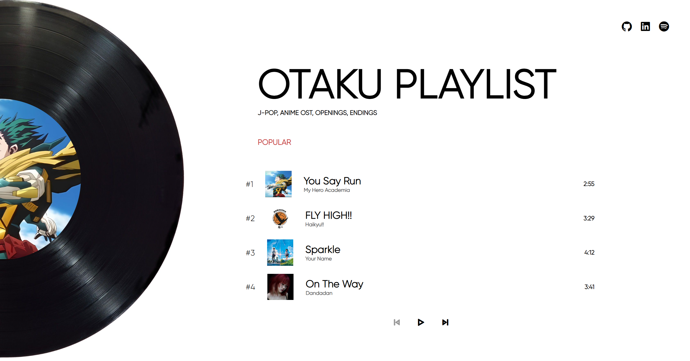

# 🎧 Otaku Playlist

A personal playlist crafted for the anime kid inside me 🌸.  
This project is a simple web music player featuring some of my favorite Japanese songs, anime openings, and OSTs that I vibe with as an otaku myself. The goal was not just to play music, but to create a calm aesthetic space that *feels* like an anime corner on the web.

---

## 🌸 About the Project

Otaku Playlist is a small love letter to anime music.  
I wanted to build something that looks minimal, cozy, and interactive—like opening a music app made just for anime fans. Every song in this playlist carries nostalgia, emotions, and memories from the shows I’ve watched.

---

## 📚 What I Learned

While building this project, I learned a lot more than I expected:
 
- Dynamically rendering song lists instead of hard-coding HTML  
- Handling play / pause / next / previous logic  
- Using event listeners effectively  
- Manipulating the DOM to update images and text in real time  
- Creating smooth CSS animations (rotating cover effect ✨)  
- Structuring a small project in a clean and reusable way  
- Debugging real problems like click targeting and index handling

This project helped me understand how HTML, CSS, and JavaScript actually work together to create something alive instead of just static pages.

---

## 🌐 Live Website

🎶 Listen here:  
👉 

---

## 💖 From One Otaku to Another

This playlist is more than code for me — it’s my emotions in the form of music.  
If you love anime, J-POP, or late-night OST sessions, I hope this little project gives you the same comfort it gives me 🌙🎵.

---
ありがとう 💫